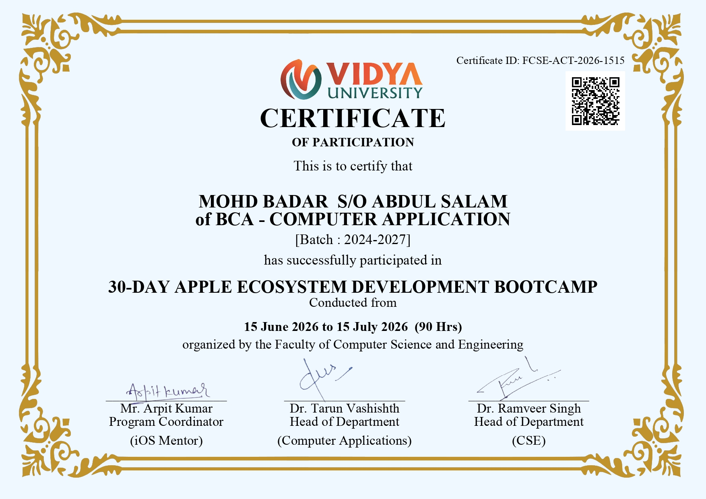
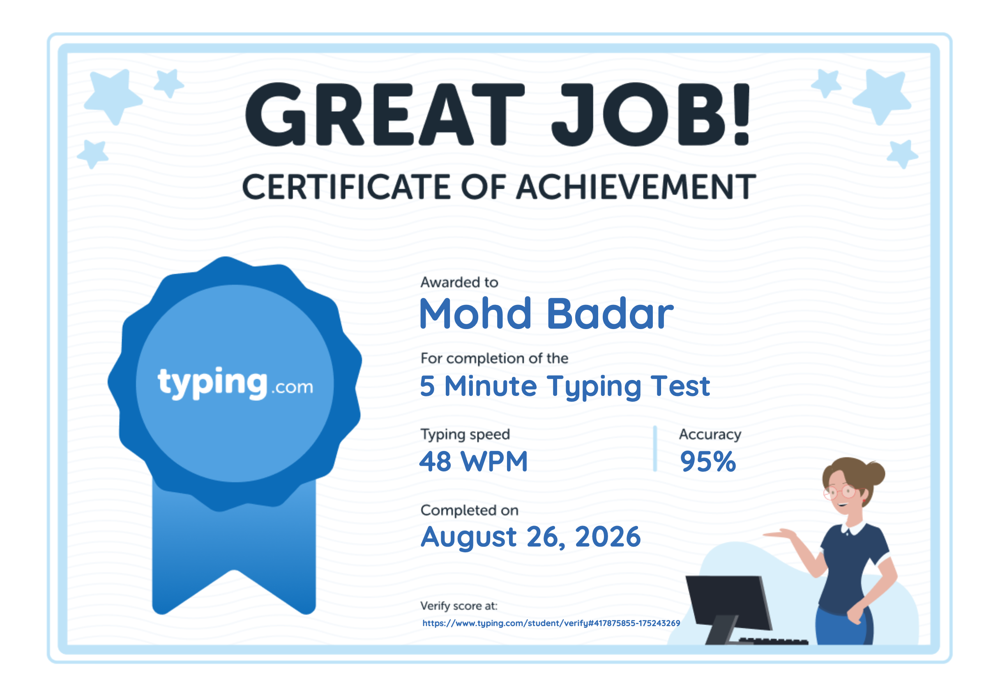

# Hi, I'm Mohd Badar 👋

🎓 BCA Student

📊 Aspiring iOS Developer and Data Analyst

## Skills
- Python
- Xcode
- Swift
- SQL
- My SQL
- Postgre SQL
- Excel
- GitHub 
- HTML
- CSS
- Fast Typing

## Current Focus
Learning Data Analytics and Building Projects
And also learning iOS Ecosystem development...

## 🛠️ Skills & Tools

  

## Apple Ecosystem Development Certificate 

## Typing Certificate 

